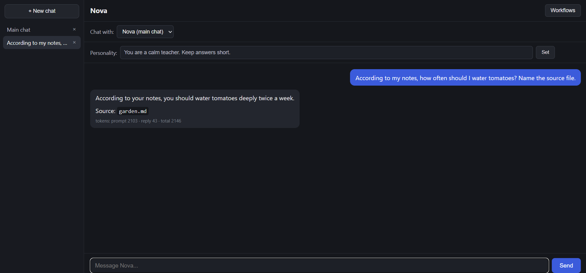
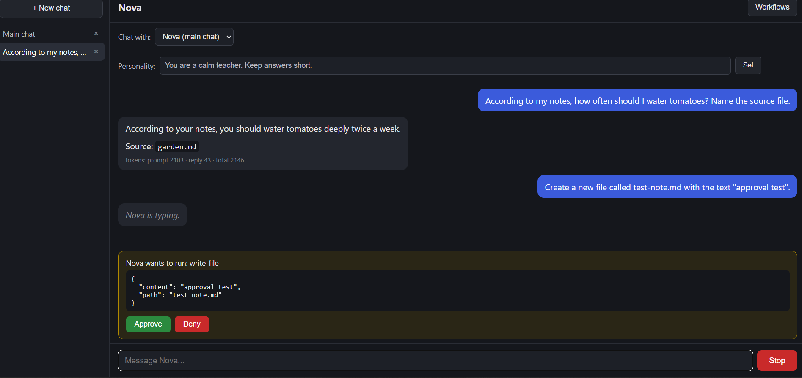
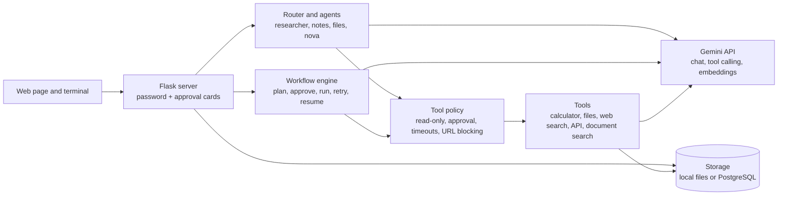

# Nova

Nova is a password-protected AI assistant built with Python and the Google Gemini API. It started as a command-line chat and now includes a web interface, a tool-using agent, specialized agents with automatic routing, a workflow engine with browser approval, document search over your own files, and optional PostgreSQL storage.

## Screenshots

Nova answering a question from my own notes and naming the source file (`garden.md`):

The approval card that appears before a tool changes anything:

## Architecture

Every tool call goes through one policy layer. Agents only see the tools they are given, and anything that changes things waits for your approval.

## Features

- Password-protected web interface built with Flask, with saved conversations and an editable system prompt
- Streaming responses, printed as they are generated
- Tool-using agent: Gemini decides when to call a built-in tool
- Built-in tools: calculator, file tools, web search, an API request tool and document search
- Document search: add your own `.txt` and `.md` files with `python -m rag add`, and Nova answers from them and names the source file
- Specialized agents: a researcher, a notes agent and a read-only file agent, each with only the tools it needs, plus an auto mode that routes each question to the right one
- Safety layer around tools: read-only flags, confirmation before anything that changes things, timeouts and unsafe-URL blocking
- Browser approval: in the web app, a tool that needs approval shows an Approve / Deny card
- Workflow engine: plans a goal, shows the plan, asks for approval, runs it with retries and saves progress so it can be resumed. Works from the terminal and from a Workflows panel in the web app
- Storage behind one interface for chats, workflow runs and indexed documents: local files by default, PostgreSQL when `DATABASE_URL` is set
- Token usage shown after every reply
- Terminal commands: `/clear`, `/history`, `/model`, `/system` and `/agent`
- API keys, model name and password kept in a `.env` file

## Setup

1. Clone the repo and open the folder.

2. Create and activate a virtual environment.

   Windows:

        python -m venv venv
        venv\Scripts\activate

   macOS / Linux:

        python -m venv venv
        source venv/bin/activate

3. Install the dependencies:

        pip install -r requirements.txt

4. Copy `.env.example` to `.env` and put your real values in it. The file looks like this:

        GEMINI_API_KEY=your_key_here
        GEMINI_MODEL=gemini-flash-lite-latest
        NOVA_PASSWORD=choose-a-password
        NOVA_SYSTEM_PROMPT=You are Nova, a friendly and precise AI assistant. Keep answers clear and concise.
        TAVILY_API_KEY=
        DATABASE_URL=
        NOVA_EMBED_MODEL=

   - `GEMINI_API_KEY` is required. Get a key from Google AI Studio.
   - `NOVA_PASSWORD` is required for the web app. If it is empty, the server refuses every request.
   - `TAVILY_API_KEY` is only needed for the web search tool.
   - `NOVA_EMBED_MODEL` is optional. Leave it empty to use `gemini-embedding-001`. See Documents below.
   - `DATABASE_URL` is optional. Leave it empty to save chats, workflow runs and indexed documents as local files. Set it to a PostgreSQL connection string to save them in a database. On your own computer, use a database's external URL; a host's internal URL only works from inside that host.
   - Never commit your `.env` file.

## Run

### Terminal chat

        python -m app.chat

Type `exit` to quit, `/clear` to forget the conversation, `/history` to see recent messages, `/model` to see the model in use, `/system` to see or change the personality, or `/agent` to talk to a specialized agent (see Specialized agents below). A tool that changes things asks you `[y/N]` in the terminal first.

### Web app

        flask --app web.server run

Open http://127.0.0.1:5000 in your browser. The browser asks for a login. Use any username and your `NOVA_PASSWORD`.

When Nova wants to run a tool that changes things, such as writing a file or calling an API, a card appears above the message box. Nothing runs until you click **Approve**, and **Deny** cancels it. If you don't answer within 60 seconds, it counts as a denial.

The **Workflows** button in the header opens the workflow panel (see below).

## Tools

Nova can call these tools when a request needs them:

- Calculator
- File tools: list, read and write files in the `workspace/` folder
- Web search (needs `TAVILY_API_KEY`)
- API request tool
- Document search: finds passages in the files you added with `python -m rag add` (see Documents below)

Tools are checked before they run. Read-only tools run freely, tools that change things need your approval, every call has a timeout, and the web and API tools refuse unsafe URLs.

## Documents

Nova can answer questions from your own notes. Add `.txt` or `.md` files and Nova searches them by meaning, so your question doesn't need the same words as the file.

    python -m rag add notes.md garden.md
    python -m rag list
    python -m rag search "how often should I water tomatoes"
    python -m rag remove notes.md
    python -m rag clear

Then ask Nova a question in the terminal chat or the web app. When the answer is in your files, Nova uses the `search_documents` tool and names the source file.

- Adding a file again replaces the old copy. Files up to 300 KB are accepted.
- Embeddings use `gemini-embedding-001`. Set `NOVA_EMBED_MODEL` to change it. Vectors from different models can't be compared, so after changing the model run `python -m rag clear` and add your files again.
- Storage follows `DATABASE_URL`: local files in `rag_data/` (ignored by Git) by default, or a table called `rag_chunks` in PostgreSQL.
- Adding files and searching send text to the Gemini API. Don't add anything you wouldn't send to Google.

## Workflows

Give Nova a goal in plain words. It plans the steps, shows you the plan, and runs nothing until you approve it. Nothing is saved until then either.

### In the terminal

        python -m workflows "list the files in my workspace folder"
        python -m workflows --list
        python -m workflows --resume WORKFLOW_ID

Options:

- `--write-tools` lets plans use tools that change things (each write still asks first)
- `--no-critic` skips the extra model review of the plan

### In the web app

Click **Workflows**, type a goal and click **Plan**. Review the plan, then click **Run plan** or **Discard**. While it runs you see each step's status, and a step that changes things shows the usual Approve / Deny card. A finished or interrupted run appears under **Saved workflows**, and unfinished ones have a **Resume** button.

- Tools that change things are off unless you tick **Allow tools that change things**.
- Only one workflow can plan or run at a time.
- **Cancel** stops the workflow after the current step.
- A workflow stops after 10 minutes.

## Specialized agents

Besides the main chat, Nova has small agents that each do one job with only the tools that job needs:

- `researcher`: web search and the calculator, for current facts and arithmetic
- `notes`: document search only, so it answers only from files you added with `python -m rag add`
- `files`: lists and reads files in `workspace/`. Read-only
- `nova`: the general chat with every tool. Auto mode uses it for anything the specialists don't cover. It is the only agent that can write files or call APIs, and each of those still asks you first

An agent gets a copy of the main tool registry that holds only its tools, and the copy keeps the same approval policy and timeouts. A notes agent can't search the web or write files because those tools aren't there for it to call.

Each agent keeps its own saved conversation, separate from your main chat. A session resumes where the last one ended, in the terminal and in the web page alike.

### In the terminal

        python -m agents                      show usage and the list of agents
        python -m agents notes                chat with one agent
        python -m agents notes --clear        delete that agent's saved conversation
        python -m agents --route "my question"  show which agent would handle it

Type `exit` to leave an agent chat. Commands like `--clear` go in PowerShell or your shell, not at the `You:` prompt.

### Auto mode

        python -m agents --auto
        python -m agents --auto --smart
        python -m agents nova --clear

Each message goes to the first of these that applies:

1. The agent you pinned with `/use <agent>` (type `/auto` to go back to routing)
2. `nova`, if the message asks to create, write, save, edit or delete a file
3. The agent a simple keyword rule picks: `notes` for "my notes" or "my documents", `files` for file names and "list files", `researcher` for words like "latest", "news", "weather" and for arithmetic
4. The previous agent, if the message is four words or fewer ("and tomorrow?")
5. With `--smart` only: the model picks an agent. This costs one extra small Gemini call per message that no rule matched, and it isn't counted in the token line
6. `nova`

The reply is labelled with the agent that answered. The model can only choose from the agents above, and it can never move a file-writing request away from `nova`.

### Inside the terminal chat

Type `/agent` at the `You:` prompt to list the agents, or `/agent notes` to talk to one. Type `exit` to come back to the main chat.

### In the web app

The web page has a **Chat with:** dropdown under the header. It lists the agents, and picking one shows its description and tools. Each agent keeps its own saved conversation, and **Clear this agent's chat** deletes it. Pick **Nova (main chat)** to go back to the normal chat. Agent conversations are not listed in the sidebar.

### In the web API

The agent routes sit behind the same password as the rest of the app.

- `GET /api/agents` lists the agents and their tools
- `POST /api/agents/<name>/chat` with `{"message": "..."}` streams the reply as plain text, followed by a token line after a `\x00` byte, like `/chat`
- `GET /api/agents/<name>/history` returns the saved messages
- `DELETE /api/agents/<name>/history` clears them

`nova` and auto routing are not exposed over the web.

## Storage

Conversations, workflow runs and indexed documents are saved through small interfaces, so the storage can change without touching the rest of the app:

- **Files (default):** the main chat in `history.json`, other chats in `conversations/`, workflow runs and their event logs in `workflow_data/`, indexed documents in `rag_data/`.
- **PostgreSQL:** set `DATABASE_URL`. Nova creates its tables on first use: `conversations`, `workflow_runs`, `workflow_events` and `rag_chunks`.

Agent conversations use the same conversation storage as other chats, each under its own fixed id, so they never touch the main chat.

## Deploy to Render

1. Push the repo to GitHub and create a **Web Service** on Render from it.
2. Build command: `pip install -r requirements.txt`
3. Start command: `gunicorn web.server:app --workers 1 --threads 4 --timeout 120`
4. Add the variables from `.env` under **Environment**: at least `GEMINI_API_KEY`, `GEMINI_MODEL` and `NOVA_PASSWORD`. Optionally add `PYTHON_VERSION=3.12.3`.
5. To keep chats and workflow runs across restarts, create a **Postgres** database on Render in the same region, and add its **Internal Database URL** as `DATABASE_URL`.

Keep `--workers 1`. The workflow that is planning or running lives in the server's memory, so a second worker would not see it.

Notes for the free plan:

- The service sleeps after about 15 minutes without traffic, so the first request can take up to a minute.
- The disk is wiped on every restart, so without `DATABASE_URL`, saved chats, workflow runs and indexed documents are lost.
- A restart also stops a workflow that is running. Its progress is saved, so you can resume it from the panel.
- Free Render databases expire after 30 days. To renew: create a new free database, replace `DATABASE_URL` in **Environment** with its new Internal Database URL, then delete the old database. Chats and workflow runs saved in the old one are not carried over.

## Notes

`.env`, `history.json`, `personality.json`, `conversations/`, `workflow_data/`, `rag_data/` and `workspace/` are listed in `.gitignore`, so your keys, conversations and documents are never pushed to GitHub.

## Tests

Install the dev requirements and run the tests:

        pip install -r requirements-dev.txt
        python -m pytest

Tests run on every push with GitHub Actions. They use fake models, so they never call Gemini. The PostgreSQL tests are skipped unless `TEST_DATABASE_URL` is set.

## Roadmap

Done: tools, workflows, conversation and workflow storage on PostgreSQL, browser approval for tool calls and for workflows, document search over your own files (RAG), specialized agents with routing in the terminal, a web API and an agent panel in the web page.

Planned next: document upload in the web app, long-term memory, evaluation and logging, Docker, and a FastAPI backend.

## License

Apache License 2.0. See [LICENSE](LICENSE).